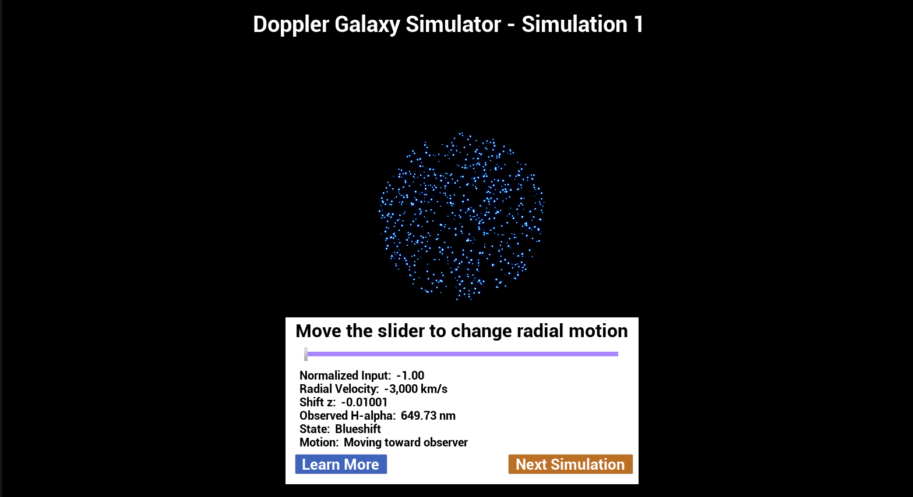
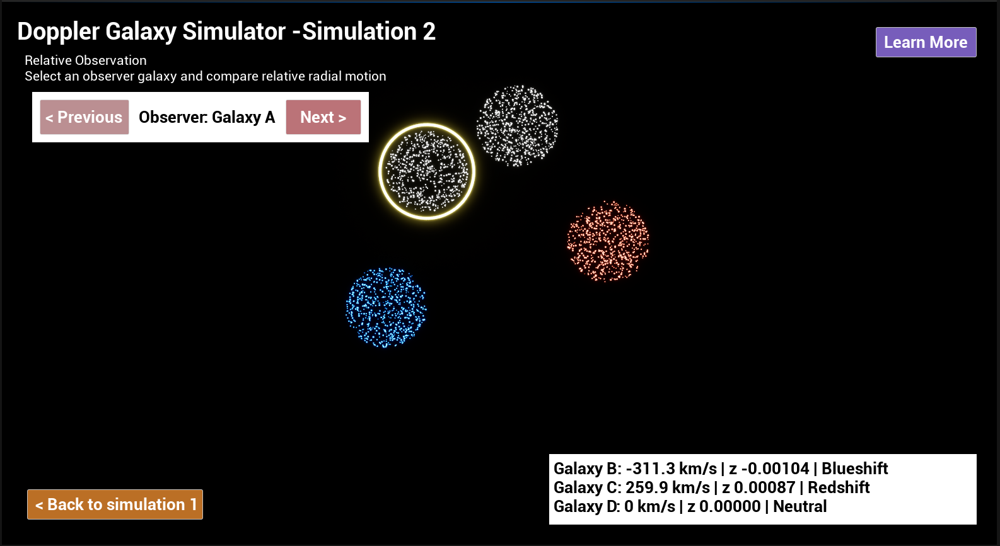
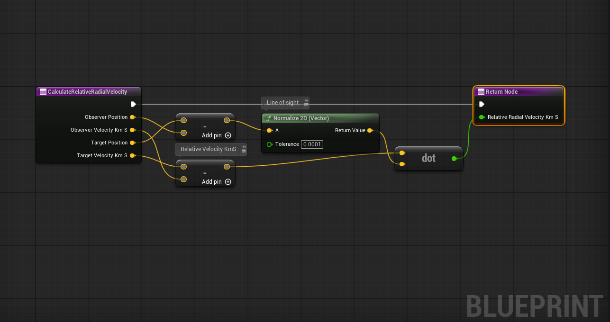
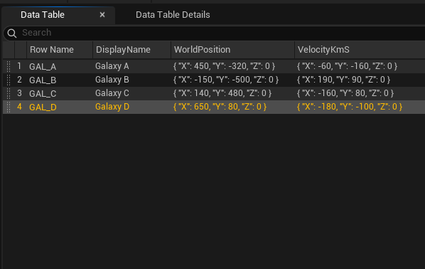

# Doppler Galaxy Simulator

The project is an interactive educational simulation of the Doppler shift in galaxies, represented as redshift and blueshift for an observer. In this simulation, I explored how mathematical and physical formulas and concepts can be used to visualize a natural phenomenon in a simplified form that is sufficient for educational purposes while also creating an engaging learning experience. 

The project developed in Unreal Engine 5.8 using Blueprints.

---

## Overview

The project contains two simulations.

### Simulation 1 — Doppler Shift

In the first simulation, the user can control a galaxy’s radial-motion through slider from -1 to 1 and observe changes in redshift parameter z, observed wavelength compared with H-alpha spectral line, shift state, and motion relative to the observer. This simulation helps visually demonstrate the basic concept of the Doppler effect. 

### Simulation 2 — Relative Observation

The second simulation provides an opportunity for the user to choose an observer galaxy from four provided galaxies. The velocity of each target is compared with the observer’s velocity. Then after finding the direction from the observer to the target, I use the dot product to focus only on the component of velocity along the line of sight. This value is then used for the Doppler calculation. Thus, Simulation 2 helps demonstrate how the Doppler effect can be used to identify the relative radial motion of galaxies form different observer reference frames. 

---

## Screenshots

### Screenshot 1

### Screenshot 2

### Screenshot 3

### Screenshot 4

---

## Key Features

- Two connected Doppler-shift simulations
- Relative-motion calculations using vectors and dot products
- H-alpha wavelength calculation
- Runtime observer switching
- Data-driven galaxy configuration
- Reusable Blueprint mathematical functions
- Niagara-based galaxy visualization
  
---

## Visualization

Each galaxy is represented using a Niagara particle system.

The simulation uses:

- blue for blueshift;
- gray for approximately neutral radial motion;
- red for redshift;

These colors are educational visual indicators and should not be interpreted as the literal visible colors of real galaxies.

---

## Architecture

The project separates user interface, simulation logic, mathematical calculations, and galaxy visualization. The main Doppler calculations are stored in a reusable Blueprint Function Library, while separate controller Blueprints manage Simulation 1 and Simulation 2. Galaxy parameters in Simulation 2 are stored in a DataTable, allowing galaxies to be spawned and initialized from structured data instead of individual hardcoded logic.

---

## Technical Challenges

This version of the project was my second attempt to represent Doppler shift in galaxies as an educational simulation. The initial version had limitations in representing the underlying physics and mathematical calculations.

1. While building and testing this project, I faced some technical challenges that helped me to improve my skills and approach to problem solving. 
During the testing of Simulation 1, the slider displayed a value of 0.00, while the simulation could still show a small redshift. The problem was caused by the internal floating-point value being slightly different from zero even though the displayed value was rounded. To address this problem, I first limited the slider input using Clamp node and then used Snap to Grid with a step of 0.01, so that the value used in the calculations matched the value shown to the user. 

2. Additionally, particles in the Niagara’s system were not always responding correctly to color changes during runtime. The initial color logic mainly affected particle initialization. To solve this, I updated the Niagara logic so that Blueprint-controlled color parameter also updates active particles during runtime.

---

## AI-Assisted Development

AI-assisted tools were used during software development as learning and technical support resources, particularly for Unreal Engine research, explanation of unfamiliar concepts, mathematical review, implementation guidance, and debugging.

I defined the project goals and constraints, built and integrated the system in Unreal Engine, tested its behavior, identified implementation problems, evaluated suggested solutions, and made the final decisions about the project's design and functionality.

---

## Technology

- Unreal Engine 5.8
- Blueprint Visual Scripting
- Niagara
- DataTables
- Blueprint Structs and Enums
- Material Editor
- Git
- Git LFS

---

## How to Run

### Requirements
Unreal Engine 5.8

1. Download the repository.
2. Ensure Git LFS assets are downloaded.
3. Open:
DopplerGalaxySimulator.uproject
5. Open or run:
L_DGS_Sim1
6. Press Play.
Simulation 2 can be opened from Simulation 1 using the interface.
6. Enjoy the learning process!

---
